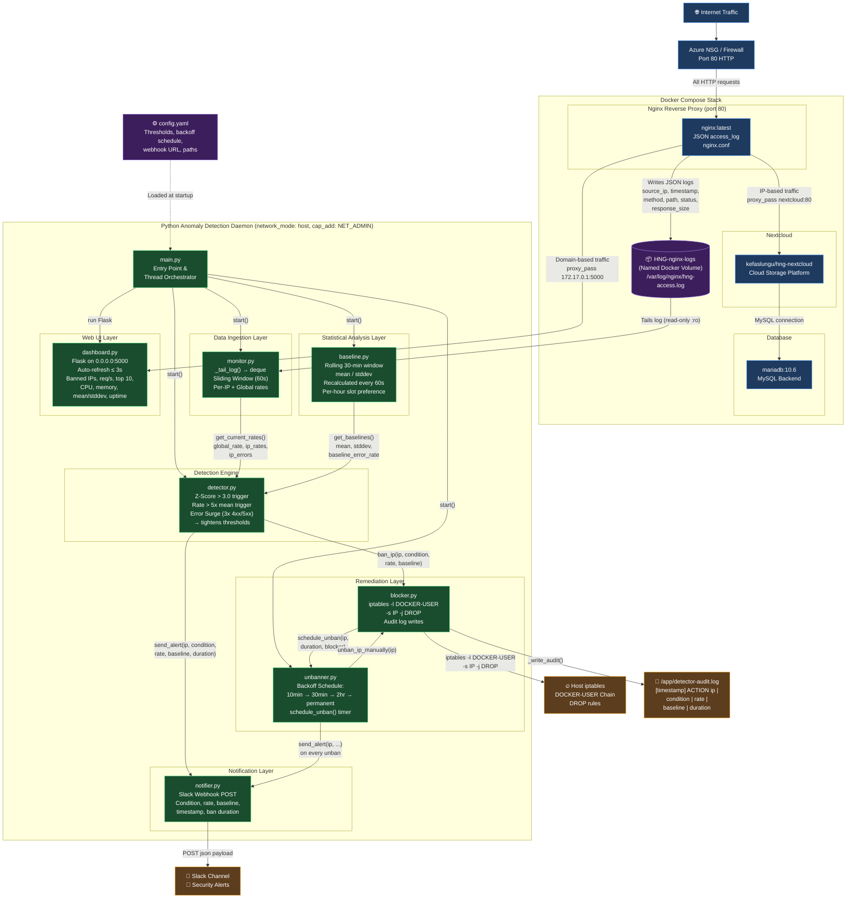

```mermaid
graph TD
    %% ===== EXTERNAL LAYER =====
    Internet["🌐 Internet Traffic"]
    Azure["Azure NSG / Firewall<br/>Port 80 HTTP"]

    Internet --> Azure

    %% ===== DOCKER COMPOSE STACK =====
    subgraph DockerCompose["Docker Compose Stack"]
        direction TB

        subgraph NginxBox["Nginx Reverse Proxy (port 80)"]
            Nginx["nginx:latest<br/>JSON access_log<br/>nginx.conf"]
        end

        subgraph NextcloudBox["Nextcloud"]
            Nextcloud["kefaslungu/hng-nextcloud<br/>Cloud Storage Platform"]
        end

        subgraph DBBox["Database"]
            DB["mariadb:10.6<br/>MySQL Backend"]
        end

        Volume[("📦 HNG-nginx-logs<br/>(Named Docker Volume)<br/>/var/log/nginx/hng-access.log")]
    end

    Azure -->|"All HTTP requests"| Nginx
    Nginx -->|"IP-based traffic<br/>proxy_pass nextcloud:80"| Nextcloud
    Nextcloud -->|"MySQL connection"| DB
    Nginx -->|"Writes JSON logs<br/>source_ip, timestamp,<br/>method, path, status,<br/>response_size"| Volume

    %% ===== DETECTOR DAEMON =====
    subgraph Detector["Python Anomaly Detection Daemon (network_mode: host, cap_add: NET_ADMIN)"]
        direction TB

        Main["main.py<br/>Entry Point &<br/>Thread Orchestrator"]

        subgraph Ingestion["Data Ingestion Layer"]
            Monitor["monitor.py<br/>_tail_log() → deque<br/>Sliding Window (60s)<br/>Per-IP + Global rates"]
        end

        subgraph Analysis["Statistical Analysis Layer"]
            Baseline["baseline.py<br/>Rolling 30-min window<br/>mean / stddev<br/>Recalculated every 60s<br/>Per-hour slot preference"]
        end

        subgraph Detection["Detection Engine"]
            DetectorMod["detector.py<br/>Z-Score > 3.0 trigger<br/>Rate > 5x mean trigger<br/>Error Surge (3x 4xx/5xx)<br/>→ tightens thresholds"]
        end

        subgraph Remediation["Remediation Layer"]
            Blocker["blocker.py<br/>iptables -I DOCKER-USER<br/>-s IP -j DROP<br/>Audit log writes"]
            Unbanner["unbanner.py<br/>Backoff Schedule:<br/>10min → 30min → 2hr → permanent<br/>schedule_unban() timer"]
        end

        subgraph Notification["Notification Layer"]
            Notifier["notifier.py<br/>Slack Webhook POST<br/>Condition, rate, baseline,<br/>timestamp, ban duration"]
        end

        subgraph UI["Web UI Layer"]
            Dashboard["dashboard.py<br/>Flask on 0.0.0.0:5000<br/>Auto-refresh ≤ 3s<br/>Banned IPs, req/s, top 10,<br/>CPU, memory, mean/stddev, uptime"]
        end

        Main -->|"start()"| Monitor
        Main -->|"start()"| Baseline
        Main -->|"start()"| DetectorMod
        Main -->|"start()"| Unbanner
        Main -->|"run Flask"| Dashboard

        Monitor -->|"get_current_rates()<br/>global_rate, ip_rates,<br/>ip_errors"| DetectorMod
        Baseline -->|"get_baselines()<br/>mean, stddev,<br/>baseline_error_rate"| DetectorMod

        DetectorMod -->|"ban_ip(ip, condition,<br/>rate, baseline)"| Blocker
        DetectorMod -->|"send_alert(ip, condition,<br/>rate, baseline, duration)"| Notifier

        Blocker -->|"schedule_unban(ip,<br/>duration, blocker)"| Unbanner
        Unbanner -->|"unban_ip_manually(ip)"| Blocker
        Unbanner -->|"send_alert(ip, ...)<br/>on every unban"| Notifier
    end

    Volume -->|"Tails log (read-only :ro)"| Monitor
    Nginx -->|"Domain-based traffic<br/>proxy_pass 172.17.0.1:5000"| Dashboard

    %% ===== OUTPUTS =====
    IPTables["🔥 Host iptables<br/>DOCKER-USER Chain<br/>DROP rules"]
    Slack["💬 Slack Channel<br/>🚨 Security Alerts"]
    AuditLog["📝 /app/detector-audit.log<br/>[timestamp] ACTION ip |<br/>condition | rate |<br/>baseline | duration"]
    ConfigFile["⚙️ config.yaml<br/>Thresholds, backoff schedule,<br/>webhook URL, paths"]

    Blocker -->|"iptables -I DOCKER-USER<br/>-s IP -j DROP"| IPTables
    Notifier -->|"POST json payload"| Slack
    Blocker -->|"_write_audit()"| AuditLog
    ConfigFile -.->|"Loaded at startup"| Main

    %% ===== STYLING =====
    classDef infra fill:#1e3a5f,stroke:#4a9eff,color:#fff
    classDef daemon fill:#1a4d2e,stroke:#4ade80,color:#fff
    classDef output fill:#5c3d1e,stroke:#f59e0b,color:#fff
    classDef volume fill:#3d1e5c,stroke:#a78bfa,color:#fff

    class Internet,Azure,Nginx,Nextcloud,DB infra
    class Main,Monitor,Baseline,DetectorMod,Blocker,Unbanner,Notifier,Dashboard daemon
    class IPTables,Slack,AuditLog output
    class Volume,ConfigFile volume
```